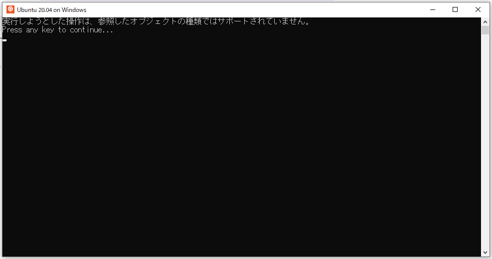
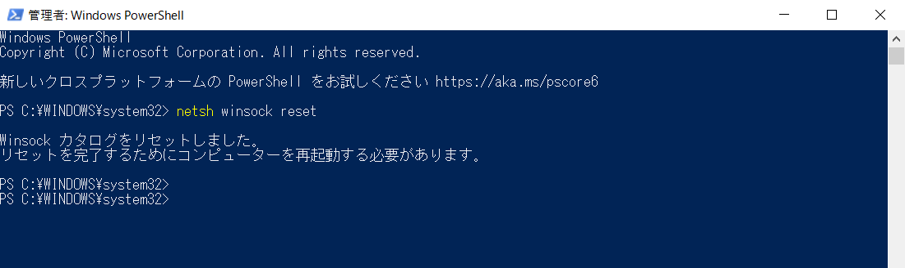

# WSL 環境で Ubuntu が起動しなくなった場合の対処方法

## 共有したいこと

WSL 環境で Ubuntu が起動しなくなった場合の対処方法。

## 事象

あるときより、突然下記メッセージが表示され WSL 環境での Ubuntu が起動しなくなりました。



## 環境

- OS：Windows 10 Pro
- バージョン：21H1
- ビルド：19043.1645

## 手順

- PowerShell を管理者モードで起動します。
- 下記コマンドを実行します。

```
$ netsh winsock reset
```


- これで Ubuntu を起動できました。  
参考情報によると、VPN に接続している状態で発生するとの報告があり、確かにボクも VPN を利用していますが、その後発生していないので定かではありません。中途半端な情報でスミマセン。。

## 参考

- Winsock module breaks WSL2
    - [https://github.com/microsoft/WSL/issues/4177](https://github.com/microsoft/WSL/issues/4177)
